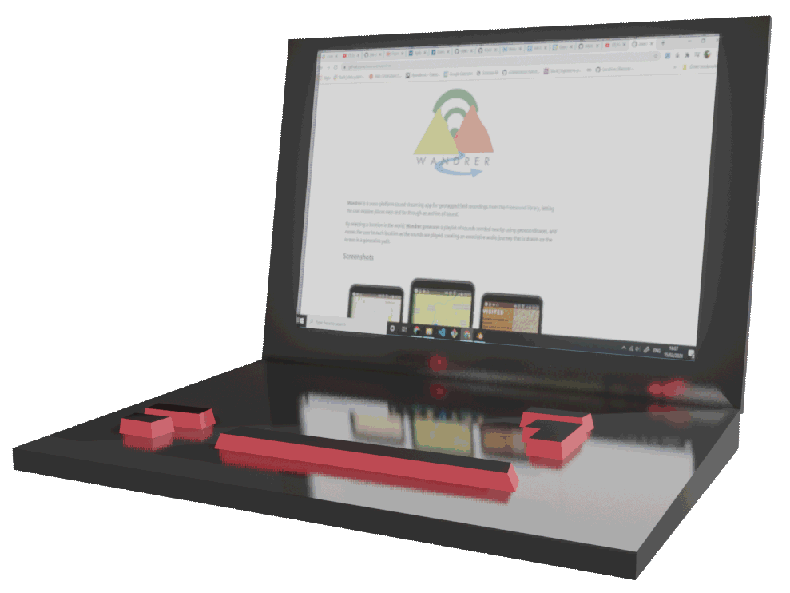
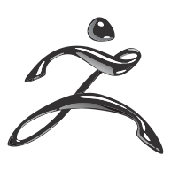

Full-stack developer & designer with focus on front-end, currently based in London U.K.

Send me a mail at: c.ornine@gmail.com 

Or check my [LinkedIn](https://www.linkedin.com/in/awenine/ "Christopher Owen LinkedIn Profile")

## Currently Learning
- Looking at the intersection of 3D graphics & animation with web-based technologies, specifically Babylon.js and vanilla Canvas animation.
- WebXR - AR & VR
- Functional programming in Js & Haskell.
- Web Audio API in Js

## Recent Projects

[</img>](https://github.com/Bobik808/Viral "Viral Github Repo") [**Viral**](https://github.com/Bobik808/Viral "Viral Github Repo") (Full Stack Web App) -> An online port of the "Pandemic" board game, re-designed around stopping the spread of misinformation. Working in a team of 6, my focus was on the game logic and front-end design.

[</img>](https://github.com/awenine/wandrer "Wandrer Github Repo") [**Wandrer**](https://github.com/awenine/wandrer "Wandrer Github Repo") (Native Mobile App) -> Wandrer is a cross-platform sound streaming app for geotagged field recordings from the Freesound library. Taking the user's location, or one chosen anywhere in the world, Wandrer builds a playlist of archived sounds recorded in the vicinity, rendering the users journey history as it progresses. Built and designed by myself.  

[**TechLog**](https://github.com/alexanderjshall/TechLog "Techlog Github Repo") (Full Stack Web App) -> A utility application designed for logging usage & defections with common technologies used on off-shore oil-rigs. Working in a team of 2, I helped design unit, integration & e2e tests, as well as refactoring the front-end for accessibility and performance.

## Technologies

**Programming Languages**

**Front-end**

**Art & Design**

    

**Back-end**

    

**Testing**

 
